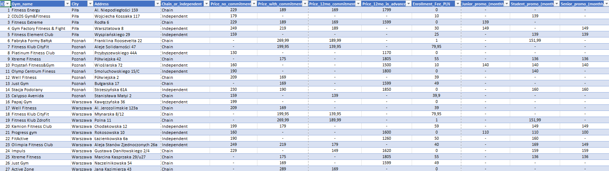
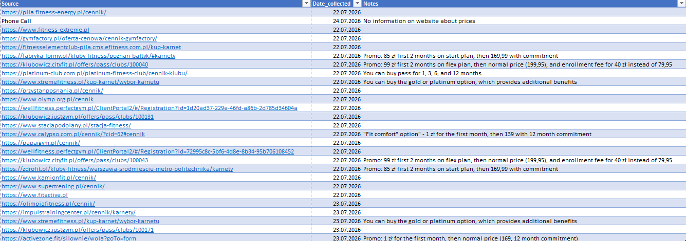
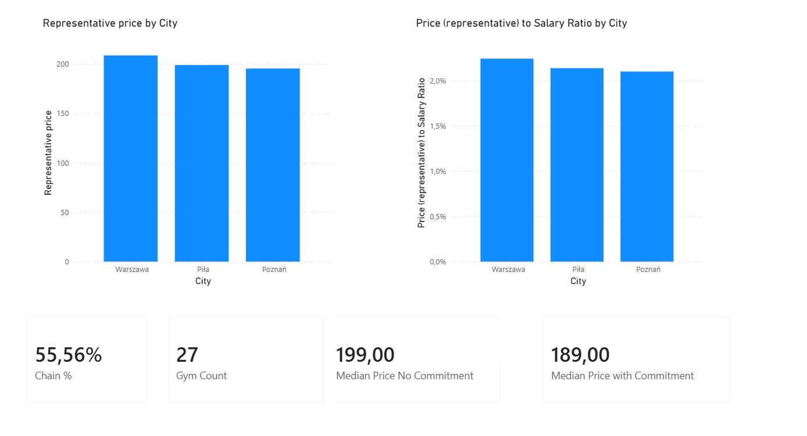
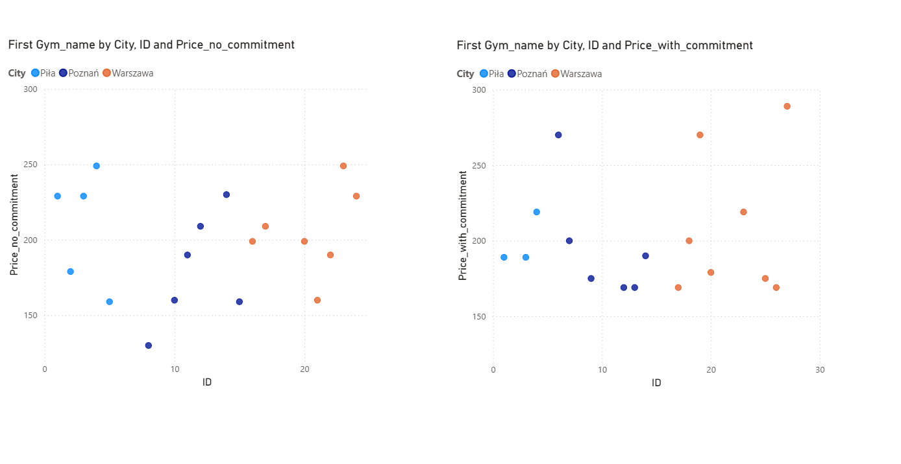
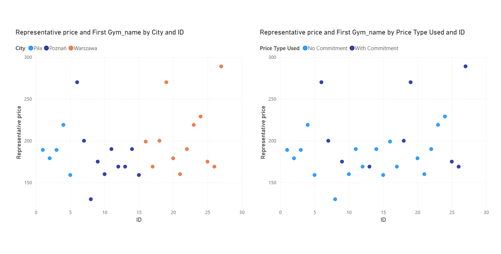
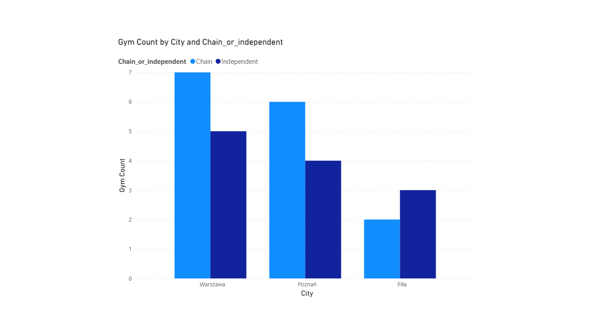

# Gym Price Comparison: Piła vs Poznań vs Warszawa

A Power BI portfolio project comparing gym membership prices across three Polish cities of different sizes — a county town (Piła), a voivodeship capital (Poznań), and the national capital (Warszawa) — measured against local average salaries rather than raw price alone.

## Goal

Raw gym prices don't tell you much on their own — 200 PLN/month means something very different in a city where the average salary is 7,700 PLN than in one where it's 10,700 PLN. This project asks: **which city actually offers the most affordable gym access relative to what people earn there?**

## Data

- **27 gyms** manually collected across three cities: Piła (5), Poznań (10), Warszawa (12)
- Gym counts are not equal, and that's intentional, not a data gap. Piła's 5 gyms represent its full local market. Poznań and Warszawa's counts stopped once chain markets ran out of unique brands — chains confirmed to have identical pricing across every location within a city, so additional branches would be duplicate data points, not new information.
- **Invite-only / referral-required premium gyms** (common in Warszawa) were explicitly excluded — they're not publicly accessible and not comparable to standard gyms.
- Reference data: average monthly gross salary per city (GUS, 2024).

All raw data is in `Gym_price_comparison.xlsx` (sheets: `Gyms_raw`, `Salaries_Reference`).

## Key methodology decisions

A few judgment calls shaped this analysis. Documenting them here rather than burying them, since they affect how the results should be read:

- **"Representative Price"**: gyms in this dataset offer different pricing structures (no-commitment, with-commitment, 12-month commitment), and not every gym publishes all three. Rather than comparing incompatible price types, each gym is assigned a single representative price using a fallback priority: **with-commitment price first** (reflecting the option most members actually buy), falling back to no-commitment, then 12-month commitment, if with-commitment isn't published. A handful of gyms that only publish 12-month-in-advance pricing are excluded from this measure.
- **No price-based quality tier.** An earlier version of this project planned a Budget/Mid/Premium tier calculated from price. This was dropped: price is not a reliable proxy for gym quality — a cheaper gym can be better maintained than an expensive one. Rather than smuggle in that assumption through a "data-driven" threshold, the tier concept was cut entirely.
- **No gym density metric.** Because chain locations were deliberately deduplicated (see above), a raw count of gyms per city would understate real physical gym access, especially in Warszawa. A "gyms per 10k residents" metric was planned originally and dropped once this became clear — it would have implied gym scarcity in dense chain markets that doesn't exist.
- **No 24h-access percentage.** Same root cause: a chain gym appears once in the dataset regardless of how many of its physical locations offer 24h access, so any percentage built from `Open_24h` would be systematically unreliable rather than just noisy. Dropped rather than shown with a caveat.
- **Chain vs. independent split remains valid**, since it's a statement about the composition of unique gym *brands* per market, not physical location counts — it doesn't depend on deduplication in the same way.

## Findings

- **Warszawa is the least affordable city relative to income**, despite having the highest salaries of the three — its gym prices are high enough that the price-to-salary ratio still comes out on top at **2.24%**. Piła is second at **2.14%**, and Poznań has the most favorable ratio at **2.10%** — the most affordable city once local salaries are factored in, not just the one with the lowest sticker prices. The spread between cities is modest (about 0.14 percentage points), so this is a real but small effect, not a dramatic difference in affordability.
- **Chains dominate Warszawa and Poznań's gym markets**, while Piła leans independent — visible directly in the Market Depth page.
- **Pricing structure differs by gym type**: chains lean toward commitment-based pricing, independents more often offer flexible no-commitment options. This is part of why a single "Representative Price" measure was necessary rather than comparing one price column directly across all gyms.

## Dashboard pages

1. **Overview** — headline KPIs (chain %, gym count, median prices) and the core affordability comparison (Representative Price and Price-to-Salary Ratio by city).

   

2. **Pricing Structure** — no-commitment vs. with-commitment prices shown separately, to make visible *why* the blended Representative Price looks the way it does.

   

3. **Distribution** — per-gym scatter view (not just city averages), so sample size differences between cities are visible rather than hidden behind an average.

   

4. **Market Depth** — chain vs. independent split, overall and by city.

   

## Limitations

- Sample sizes are small and uneven by design (5 / 10 / 12). Piła's 5 gyms represent its essentially complete local market, but Warszawa's 12 unique brands represent a much smaller fraction of a city of ~2 million — its results should be read as a sample of the mainstream/chain gym market, not a full picture of gym access in the city.
- Prices reflect standard published rates as of July 2026 collection; promotional/introductory pricing was intentionally excluded and is noted per-gym in the source data instead.
- This is a single-point-in-time snapshot: prices reflect what was published at the moment of collection, not tracked over time. A gym raising prices or running a new promotion after July 2026 won't be reflected here.

## Tools

Excel (data collection) → Power Query (cleaning, type conversion) → Power BI (data model, DAX measures, dashboard).
